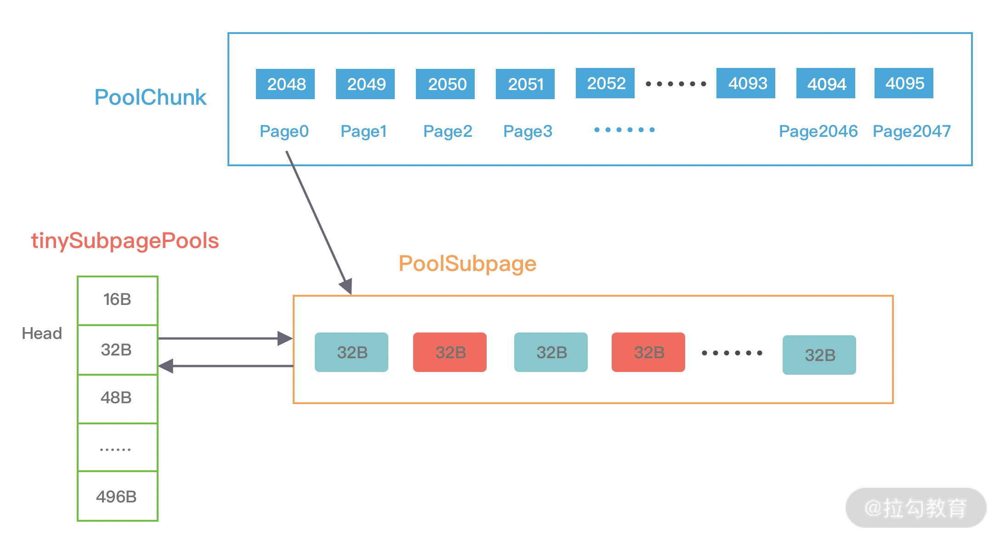

## 前言
netty是一个高性能网络框架，处理大量的网络数据。在连接建立，读数据，处理，写数据的过程中势必需要大量的内存，而大量的内存的生命周期很短，如果只依靠jvm的垃圾回收机制，效率很低，大量的内存分配和回收需要时间。那么，如何才能减少内存频繁的分配和回收呢？像连接池，线程池的思想一样，netty也实现了内存池来解决这一问题，都是套路啊。。。
## 内存池
Netty 高性能的内存管理也是借鉴 jemalloc 实现的，它需要解决两个经典的核心问题：
1. 在单线程或者多线程的场景下，如何高效地进行内存分配和回收？
2. 如何减少内存碎片，提高内存的有效利用率？
### 内存规格
Netty 保留了内存规格分类的设计理念，不同大小的内存块采用的分配策略是不同的，具体内存规格的分类情况如下图所示。

上图中 Tiny 代表 0 ~ 512B 之间的内存块，Samll 代表 512B ~ 8K 之间的内存块，Normal 代表 8K ~ 16M 的内存块，Huge 代表大于 16M 的内存块。在 Netty 中定义了一个 SizeClass 类型的枚举，用于描述上图中的内存规格类型，分别为 Tiny、Small 和 Normal。但是图中 Huge 并未在代码中定义，当分配大于 16M 时，可以归类为 Huge 场景，Netty 会直接使用非池化的方式进行内存分配。
Netty 在每个区域内又定义了更细粒度的内存分配单位，分别对应为 Chunk、Page、Subpage
1. Chunk 是 Netty 向操作系统申请内存的单位，所有的内存分配操作也是基于 Chunk 完成的，Chunk 可以理解为 Page 的集合，每个 Chunk 默认大小为 16M。
2. Page 是 Chunk 用于管理内存的单位，Netty 中的 Page 的大小为 8K，不要与 Linux 中的内存页 Page 相混淆了。假如我们需要分配 64K 的内存，需要在 Chunk 中选取 8 个 Page 进行分配。
3. Subpage 负责 Page 内的内存分配，假如我们分配的内存大小远小于 Page，直接分配一个 Page 会造成严重的内存浪费，所以需要将 Page 划分为多个相同的子块进行分配，这里的子块就相当于 Subpage。按照 Tiny 和 Small 两种内存规格，SubPage 的大小也会分为两种情况。在 Tiny 场景下，最小的划分单位为 16B，按 16B 依次递增，16B、32B、48B ...... 496B；在 Small 场景下，总共可以划分为 512B、1024B、2048B、4096B 四种情况。Subpage 没有固定的大小，需要根据用户分配的缓冲区大小决定，例如分配 1K 的内存时，Netty 会把一个 Page 等分为 8 个 1K 的 Subpage。
### 内存池架构设计
Netty 抽象出一些核心组件，如 PoolArena、PoolChunk、PoolChunkList、PoolSubpage、PoolThreadCache、MemoryRegionCache 等
#### PoolArena
PoolArena 抽象类提供了 HeapArena 和 DirectArena 两个子类，分别对应堆内存和直接内存，下图是PoolArena的结构

PoolArena 的数据结构包含两个 PoolSubpage 数组和六个 PoolChunkList，两个 PoolSubpage 数组分别存放 Tiny 和 Small 类型的内存块，六个 PoolChunkList 分别存储不同利用率的 Chunk，构成一个双向循环链表。

之前我们介绍了 Netty 内存规格的分类，PoolArena 对应实现了 Subpage 和 Chunk 中的内存分配，其 中 PoolSubpage 用于分配小于 8K 的内存，PoolChunkList 用于分配大于 8K 的内存。

PoolSubpage 也是按照 Tiny 和 Small 两种内存规格，设计了tinySubpagePools 和 smallSubpagePools 两个数组，根据关于 Subpage 的介绍，我们知道 Tiny 场景下，内存单位最小为 16B，按 16B 依次递增，共 32 种情况，Small 场景下共分为 512B、1024B、2048B、4096B 四种情况，分别对应两个数组的长度大小，每种粒度的内存单位都由一个 PoolSubpage 进行管理。假如我们分配 20B 大小的内存空间，也会向上取整找到 32B 的 PoolSubpage 节点进行分配。

PoolChunkList 用于 Chunk 场景下的内存分配，PoolArena 中初始化了六个 PoolChunkList，分别为 qInit、q000、q025、q050、q075、q100，这与 jemalloc 中 run 队列思路是一致的，它们分别代表不同的内存使用率，如下所示：

1. qInit，内存使用率为 0 ~ 25% 的 Chunk。
2. q000，内存使用率为 1 ~ 50% 的 Chunk。
3. q025，内存使用率为 25% ~ 75% 的 Chunk。
4. q050，内存使用率为 50% ~ 100% 的 Chunk。
5. q075，内存使用率为 75% ~ 100% 的 Chunk。
6. q100，内存使用率为 100% 的 Chunk。
#### PoolChunkList
PoolChunkList 负责管理多个 PoolChunk 的生命周期，同一个 PoolChunkList 中存放内存使用率相近的 PoolChunk，这些 PoolChunk 同样以双向链表的形式连接在一起。因为 PoolChunk 经常要从 PoolChunkList 中删除，并且需要在不同的 PoolChunkList 中移动，所以双向链表是管理 PoolChunk 时间复杂度较低的数据结构。
每个 PoolChunkList 都有内存使用率的上下限：minUsage 和 maxUsage，当 PoolChunk 进行内存分配后，如果使用率超过 maxUsage，那么 PoolChunk 会从当前 PoolChunkList 移除，并移动到下一个 PoolChunkList。同理，PoolChunk 中的内存发生释放后，如果使用率小于 minUsage，那么 PoolChunk 会从当前 PoolChunkList 移除，并移动到前一个 PoolChunkList。
#### PoolChunk
Netty 内存的分配和回收都是基于 PoolChunk 完成的，PoolChunk 是真正存储内存数据的地方，每个 PoolChunk 的默认大小为 16M，首先我们看下 PoolChunk 数据结构的定义：
```
final class PoolChunk<T> implements PoolChunkMetric {

    final PoolArena<T> arena;

    final T memory; // 存储的数据

    private final byte[] memoryMap; // 满二叉树中的节点是否被分配，数组大小为 4096

    private final byte[] depthMap; // 满二叉树中的节点高度，数组大小为 4096

    private final PoolSubpage<T>[] subpages; // PoolChunk 中管理的 2048 个 8K 内存块

    private int freeBytes; // 剩余的内存大小

    PoolChunkList<T> parent;

    PoolChunk<T> prev;

    PoolChunk<T> next;
    // 省略其他代码

}
```
PoolChunk 可以理解为 Page 的集合，Page 只是一种抽象的概念，实际在 Netty 中 Page 所指的是 PoolChunk 所管理的子内存块，每个子内存块采用 PoolSubpage 表示。Netty 会使用伙伴算法将 PoolChunk 分配成 2048 个 Page，最终形成一颗满二叉树，二叉树中所有子节点的内存都属于其父节点管理，如下图所示。

结合 PoolChunk 的结构图，我们介绍一下 PoolChunk 中几个重要的属性：

depthMap 用于存放节点所对应的高度。例如第 2048 个节点 depthMap[1025] = 10。

memoryMap 用于记录二叉树节点的分配信息，memoryMap 初始值与 depthMap 是一样的，随着节点被分配，不仅节点的值会改变，而且会递归遍历更新其父节点的值，父节点的值取两个子节点中最小的值。

subpages 对应上图中 PoolChunk 内部的 Page0、Page1、Page2 ...... Page2047，Netty 中并没有 Page 的定义，直接使用 PoolSubpage 表示。当分配的内存小于 8K 时，PoolChunk 中的每个 Page 节点会被划分成为更小粒度的内存块进行管理，小内存块同样以 PoolSubpage 管理。从图中可以看出，小内存的分配场景下，会首先找到对应的 PoolArena ，然后根据计算出对应的 tinySubpagePools 或者 smallSubpagePools 数组对应的下标，如果对应数组元素所包含的 PoolSubpage 链表不存在任何节点，那么将创建新的 PoolSubpage 加入链表中。

#### PoolSubpage
```
final class PoolSubpage<T> implements PoolSubpageMetric {

    final PoolChunk<T> chunk;

    private final int memoryMapIdx; // 对应满二叉树节点的下标

    private final int runOffset; // PoolSubpage 在 PoolChunk 中 memory 的偏移量

    private final long[] bitmap; // 记录每个小内存块的状态

    // 与 PoolArena 中 tinySubpagePools 或 smallSubpagePools 中元素连接成双向链表

    PoolSubpage<T> prev;

    PoolSubpage<T> next;

    int elemSize; // 每个小内存块的大小

    private int maxNumElems; // 最多可以存放多少小内存块：8K/elemSize

    private int numAvail; // 可用于分配的内存块个数
    // 省略其他代码

}
```
1. PoolSubpage 通过位图 bitmap 记录子内存是否已经被使用，bit 的取值为 0 或者 1
2. PoolArena 在创建是会初始化 tinySubpagePools 和 smallSubpagePools 两个 PoolSubpage 数组，数组的大小分别为 32 和 4。假如我们现在需要分配 20B 大小的内存，会向上取整为 32B，从满二叉树的第 11 层找到一个 PoolSubpage 节点，并把它等分为 8KB/32B = 256B 个小内存块，然后找到这个 PoolSubpage 节点对应的 PoolArena，将 PoolSubpage 节点与 tinySubpagePools[1] 对应的 head 节点连接成双向链表，形成下图所示的结构。

下次再有 32B 规格的内存分配时，会直接查找 PoolArena 中 tinySubpagePools[1] 元素的 next 节点是否存在可用的 PoolSubpage，如果存在将直接使用该 PoolSubpage 执行内存分配，从而提高了内存分配效率，其他内存规格的分配原理类似。
#### PoolThreadCache & MemoryRegionCache
PoolThreadCache 顾名思义，对应的是 jemalloc 中本地线程缓存的意思。那么 PoolThreadCache 是如何被使用的呢？它可以缓存哪些类型的数据呢？

当内存释放时，与 jemalloc 一样，Netty 并没有将缓存归还给 PoolChunk，而是使用 PoolThreadCache 缓存起来，当下次有同样规格的内存分配时，直接从 PoolThreadCache 取出使用即可。PoolThreadCache 缓存 Tiny、Small、Normal 三种类型的数据，而且根据堆内和堆外内存的类型进行了区分，如 PoolThreadCache 的源码定义所示：
```
final class PoolThreadCache {

    final PoolArena<byte[]> heapArena;

    final PoolArena<ByteBuffer> directArena;

    private final MemoryRegionCache<byte[]>[] tinySubPageHeapCaches;

    private final MemoryRegionCache<byte[]>[] smallSubPageHeapCaches;

    private final MemoryRegionCache<ByteBuffer>[] tinySubPageDirectCaches;

    private final MemoryRegionCache<ByteBuffer>[] smallSubPageDirectCaches;

    private final MemoryRegionCache<byte[]>[] normalHeapCaches;

    private final MemoryRegionCache<ByteBuffer>[] normalDirectCaches;
    // 省略其他代码

}
```
MemoryRegionCache 实际就是一个队列，当内存释放时，将内存块加入队列当中，下次再分配同样规格的内存时，直接从队列中取出空闲的内存块。

PoolThreadCache 将不同规格大小的内存都使用单独的 MemoryRegionCache 维护，如下图所示，图中的每个节点都对应一个 MemoryRegionCache，例如 Tiny 场景下对应的 32 种内存规格会使用 32 个 MemoryRegionCache 维护，所以 PoolThreadCache 源码中 Tiny、Small、Normal 类型的 MemoryRegionCache 数组长度分别为 32、4、3。

### 内存分配实现原理
在申请的内存大于 8K 时，PoolChunk 会以 Page 为单位进行内存分配。当申请的内存大小小于 8K 时，会由 PoolSubpage 管理更小粒度的内存分配。

PoolArena 分配的内存被释放后，不会立即会还给 PoolChunk，而且会缓存在本地私有缓存 PoolThreadCache 中，在下一次进行内存分配时，会优先从 PoolThreadCache 中查找匹配的内存块。

#### Page 级别的内存分配
每个 PoolChunk 默认大小为 16M，PoolChunk 是通过伙伴算法管理多个 Page，每个 PoolChunk 被划分为 2048 个 Page，最终通过一颗满二叉树实现
假如用户需要依次申请 8K、16K、8K 的内存，通过这里例子我们详细描述下 PoolChunk 如何分配 Page 级别的内存
```
private long allocateRun(int normCapacity) {

    // 根据分配内存大小计算二叉树对应的节点高度

    int d = maxOrder - (log2(normCapacity) - pageShifts);

    // 查找对应高度中是否存在可用节点

    int id = allocateNode(d);

    if (id < 0) {

        return id;

    }

    // 减去已分配的内存大小

    freeBytes -= runLength(id);

    return id;

}
```
第一次分配 8K 大小的内存时，通过 d = maxOrder - (log2(normCapacity) - pageShifts) 计算得到二叉树所在节点高度为 11，其中 maxOrder 为二叉树的最大高度，normCapacity 为 8K，pageShifts 默认值为 13，因为只有当申请内存大小大于 2^13 = 8K 时才会使用 allocateRun 分配内存。然后从第 11 层查找可用的 Page，下标为 2048 的节点可以被用于分配内存，即 Page[0] 被分配使用，此时赋值 memoryMap[2048] = 12，表示该节点已经不可用，然后递归更新父节点的值，父节点的值取两个子节点的最小值，memoryMap[1024] = 11，memoryMap[512] = 10，以此类推直至 memoryMap[1] = 1。
第二次分配 16K 大小内存时，计算得到所需节点的高度为 10。此时 1024 节点已经分配了一个 8K 内存，不再满足条件，继续寻找到 1025 节点。1025 节点并未使用过，满足分配条件，于是将 1025 节点的两个子节点 2050 和 2051 全部分配出去，并赋值 memoryMap[2050] = 12，memoryMap[2051] = 12，再次递归更新父节点的值。
第三次再次分配 8K 大小的内存时，依然从二叉树第 11 层开始查找，2048 已经被使用，2049 可以被分配，赋值 memoryMap[2049] = 12，并递归更新父节点值，memoryMap[1024] = 12，memoryMap[512] = 12，以此类推直至 memoryMap[1] = 1。
#### Subpage 级别的内存分配
为了提高内存分配的利用率，在分配小于 8K 的内存时，PoolChunk 不在分配单独的 Page，而是将 Page 划分为更小的内存块，由 PoolSubpage 进行管理。
```
private long allocateSubpage(int normCapacity) {

    // 根据内存大小找到 PoolArena 中 subpage 数组对应的头结点

    PoolSubpage<T> head = arena.findSubpagePoolHead(normCapacity);

    int d = maxOrder; // 因为分配内存小于 8K，所以从满二叉树最底层开始查找

    synchronized (head) {

        int id = allocateNode(d); // 在满二叉树中找到一个可用的节点

        if (id < 0) {

            return id;

        }

        final PoolSubpage<T>[] subpages = this.subpages; // 记录哪些 Page 被转化为 Subpage

        final int pageSize = this.pageSize; 

        freeBytes -= pageSize;

        int subpageIdx = subpageIdx(id); // pageId 到 subpageId 的转化，例如 pageId=2048 对应的 subpageId=0

        PoolSubpage<T> subpage = subpages[subpageIdx];

        if (subpage == null) {

            // 创建 PoolSubpage，并切分为相同大小的子内存块，然后加入 PoolArena 对应的双向链表中

            subpage = new PoolSubpage<T>(head, this, id, runOffset(id), pageSize, normCapacity);

            subpages[subpageIdx] = subpage;

        } else {

            subpage.init(head, normCapacity);

        }

        return subpage.allocate(); // 执行内存分配并返回内存地址

    }

}
```
假如我们需要分配 20B 大小的内存，一起分析下上述源码的执行过程：
1. 因为 20B 小于 512B，属于 Tiny 场景，按照内存规格的分类 20B 需要向上取整到 32B。
2. 根据内存规格的大小找到 PoolArena 中 tinySubpagePools 数组对应的头结点，32B 对应的 tinySubpagePools[1]。
3. 在满二叉树中寻找可用的节点用于内存分配，因为我们分配的内存小于 8K，所以直接从二叉树的最底层开始查找。假如 2049 节点是可用的，那么返回的 id = 2049。
4. 找到可用节点后，因为 pageIdx 是从叶子节点 2048 开始记录索引，而 subpageIdx 需要从 0 开始的，所以需要将 pageIdx 转化为 subpageIdx，例如 2048 对应的 subpageIdx = 0，2049 对应的 subpageIdx = 1，以此类推。
5. 如果 PoolChunk 中 subpages 数组的 subpageIdx 下标对应的 PoolSubpage 不存在，那么将创建一个新的 PoolSubpage，并将 PoolSubpage 切分为相同大小的子内存块，示例对应的子内存块大小为 32B，最后将新创建的 PoolSubpage 节点与 tinySubpagePools[1] 对应的 head 节点连接成双向链表。
6. 最后 PoolSubpage 执行内存分配并返回内存地址。
PoolSubpage 通过位图 bitmap 记录每个内存块是否已经被使用。在上述的示例中，8K/32B = 256，因为每个 long 有 64 位，所以需要 256/64 = 4 个 long 类型的即可描述全部的内存块分配状态，因此 bitmap 数组的长度为 4，从 bitmap[0] 开始记录，每分配一个内存块，就会移动到 bitmap[0] 中的下一个二进制位，直至 bitmap[0] 的所有二进制位都赋值为 1，然后继续分配 bitmap[1]，以此类推。
当 bitmap 分成成功后，PoolSubpage 会将可用节点的个数 numAvail 减 1，当 numAvail 降为 0 时，表示 PoolSubpage 已经没有可分配的内存块，此时需要从 PoolArena 中 tinySubpagePools[1] 的双向链表中删除。
#### PoolThreadCache 的内存分配
在分配 Tiny、Small 和 Normal 类型的内存时，都会尝试先从 PoolThreadCache 中进行分配。
1. 对申请的内存大小做向上取整，例如 20B 的内存大小会取整为 32B。
2. 当申请的内存大小小于 8K 时，分为 Tiny 和 Small 两种情况，分别都会优先尝试从 PoolThreadCache 分配内存，如果 PoolThreadCache 分配失败，才会走 PoolArena 的分配流程。
3. 当申请的内存大小大于 8K，但是小于 Chunk 的默认大小 16M，属于 Normal 的内存分配，也会优先尝试从 PoolThreadCache 分配内存，如果 PoolThreadCache 分配失败，才会走 PoolArena 的分配流程。
4. 当申请的内存大小大于 Chunk 的 16M，则不会经过 PoolThreadCache，直接进行分配。
### 内存回收实现原理
当用户线程释放内存时会将内存块缓存到本地线程的私有缓存 PoolThreadCache 中，这样在下次分配内存时会提高分配效率，但是当内存块被用完一次后，再没有分配需求，那么一直驻留在内存中又会造成浪费。接下来我们就看下 Netty 是如何实现内存释放的呢？
```
private boolean allocate(MemoryRegionCache<?> cache, PooledByteBuf buf, int reqCapacity) {

    if (cache == null) {

        return false;

    }

    // 默认每执行 8192 次 allocate()，就会调用一次 trim() 进行内存整理

    boolean allocated = cache.allocate(buf, reqCapacity);

    if (++ allocations >= freeSweepAllocationThreshold) {

        allocations = 0;

        trim();

    }

    return allocated;

}

void trim() {

    trim(tinySubPageDirectCaches);

    trim(smallSubPageDirectCaches);

    trim(normalDirectCaches);

    trim(tinySubPageHeapCaches);

    trim(smallSubPageHeapCaches);

    trim(normalHeapCaches);

}
public final void trim() {

    int free = size - allocations;

    allocations = 0;

    // We not even allocated all the number that are

    if (free > 0) {

        free(free, false);

    }

}
```
Netty 记录了 allocate() 的执行次数，默认每执行 8192 次，就会触发 PoolThreadCache 调用一次 trim() 进行内存整理，会对 PoolThreadCache 中维护的六个 MemoryRegionCache 数组分别进行整理。
通过 size - allocations 衡量内存分配执行的频繁程度，其中 size 为该 MemoryRegionCache 对应的内存规格大小，size 为固定值，例如 Tiny 类型默认为 512。allocations 表示 MemoryRegionCache 距离上一次内存整理已经发生了多少次 allocate 调用，当调用次数小于 size 时，表示 MemoryRegionCache 中缓存的内存块并不常用，从队列中取出内存块依次释放。
此外 Netty 在线程退出的时候还会回收该线程的所有内存，PoolThreadCache 重载了 finalize() 方法，在销毁前执行缓存回收的逻辑，对应源码如下：
```
protected void finalize() throws Throwable {

    try {

        super.finalize();

    } finally {

        free(true);

    }

}

void free(boolean finalizer) {

    if (freed.compareAndSet(false, true)) {

        int numFreed = free(tinySubPageDirectCaches, finalizer) +

                free(smallSubPageDirectCaches, finalizer) +

                free(normalDirectCaches, finalizer) +

                free(tinySubPageHeapCaches, finalizer) +

                free(smallSubPageHeapCaches, finalizer) +

                free(normalHeapCaches, finalizer);

        if (numFreed > 0 && logger.isDebugEnabled()) {

            logger.debug("Freed {} thread-local buffer(s) from thread: {}", numFreed,

                    Thread.currentThread().getName());

        }

        if (directArena != null) {

            directArena.numThreadCaches.getAndDecrement();

        }

        if (heapArena != null) {

            heapArena.numThreadCaches.getAndDecrement();

        }

    }

}
```
线程销毁时 PoolThreadCache 会依次释放所有 MemoryRegionCache 中的内存数据，其中 free 方法的核心逻辑与之前内存整理 trim 中释放内存的过程是一致的。


