## 前言
netty是通过eventloop实现串行无锁化的，netty里的handler并不需要同步。在jdk nio的select操作中，没有可以操作的channel时应该阻塞，但有时却返回出来，这就是jdk nio中著名的空轮询bug，在netty中通过eventloop的实现避免了这个bug，这个博客就分析一下eventloop。
## EventLoop的创建
eventloop在创建EventLoopGroup时被创建，在```EventLoopGroup bossGroup = new NioEventLoopGroup(1);```跟进去，可以看到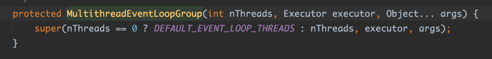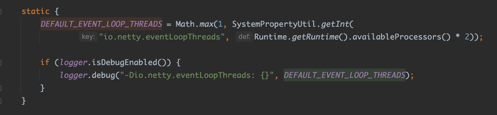，默认是创建2倍cpu核数的线程。
在```MultithreadEventExecutorGroup```构造函数中，先创建eventloop， 在创建chooser。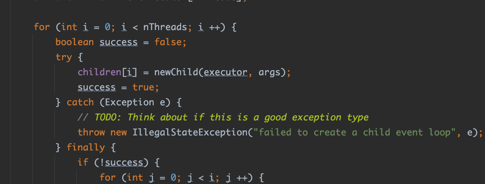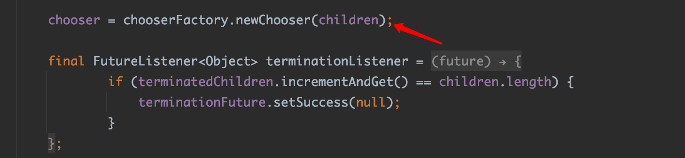
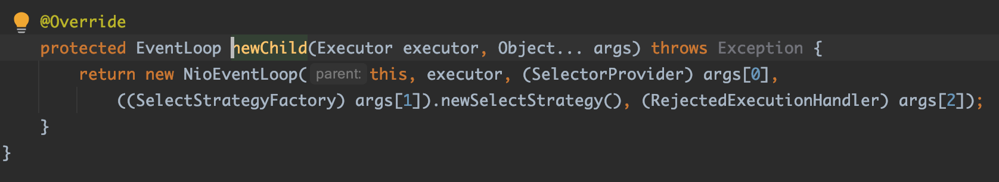
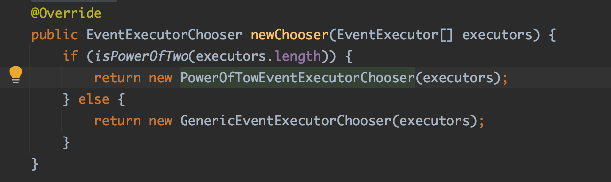
chooser就根据eventloop的数量是否是2的幂选择是否创建性能进行优化的Chooser。
## EventLoop的启动
eventloop在register或在新连接接入时启动，在这个主要分析在register时启动eventloop。
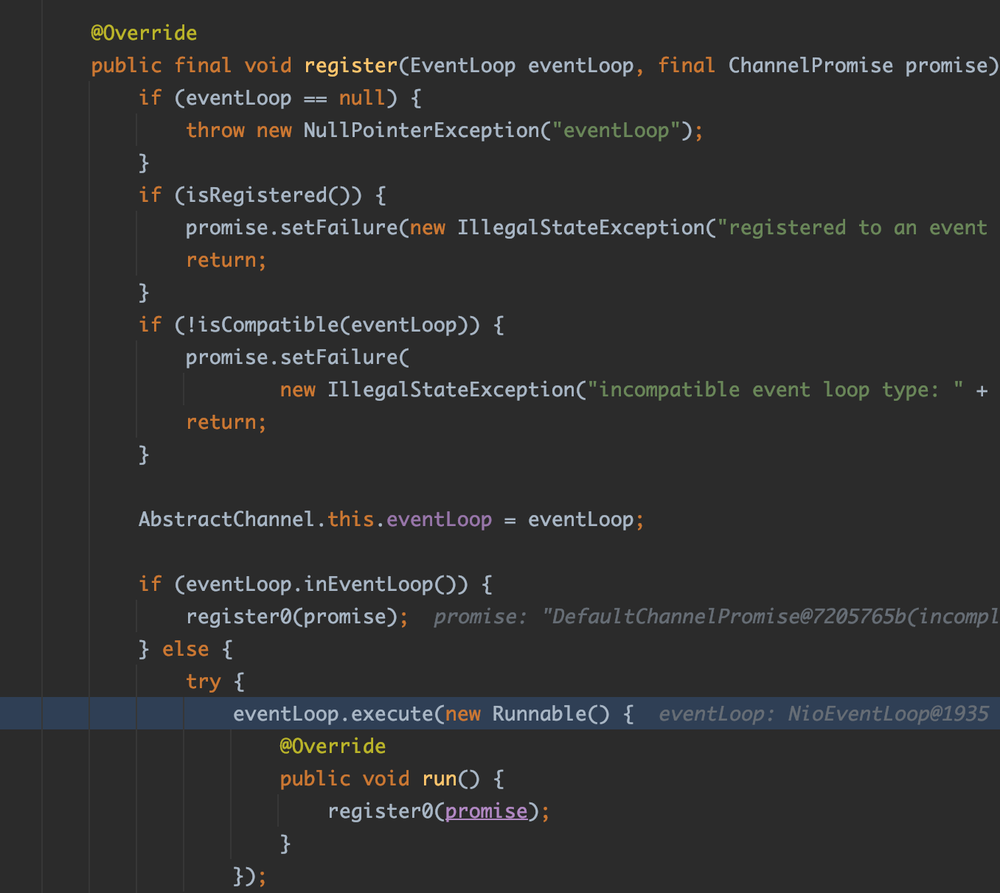!
在register中调用eventloop的execute方法传入绑定端口的task，这里跟进这个execute方法，在SingleThreadEventExecutor中
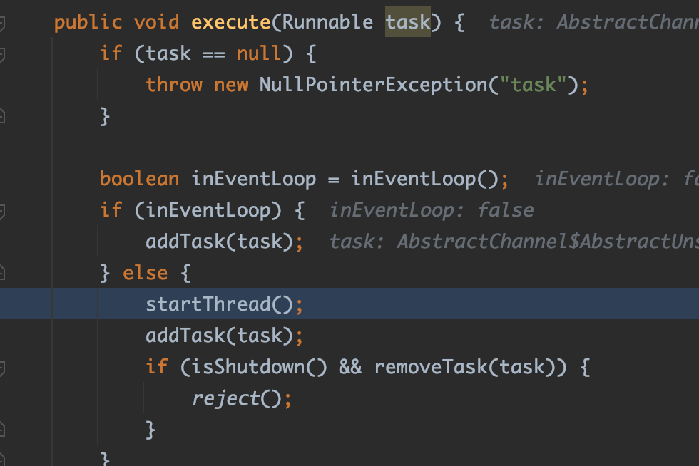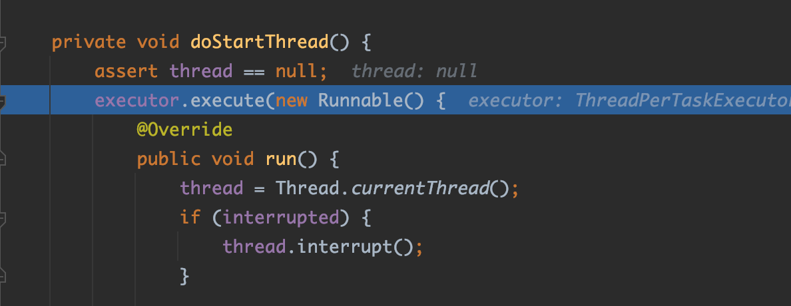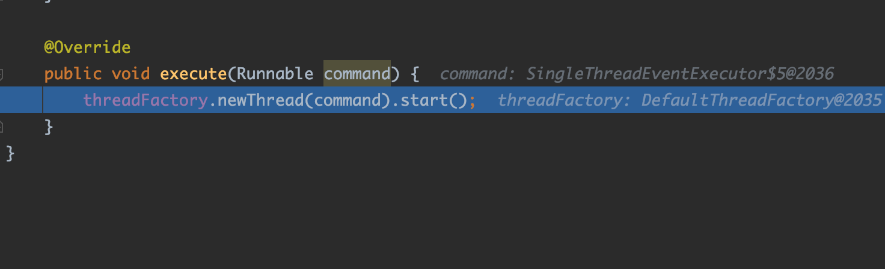
可以看到在ThreadPerTaskExecutor中new了一个thread并start
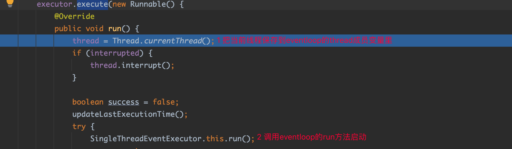
## EventLoop的run逻辑
1. 首先进行select
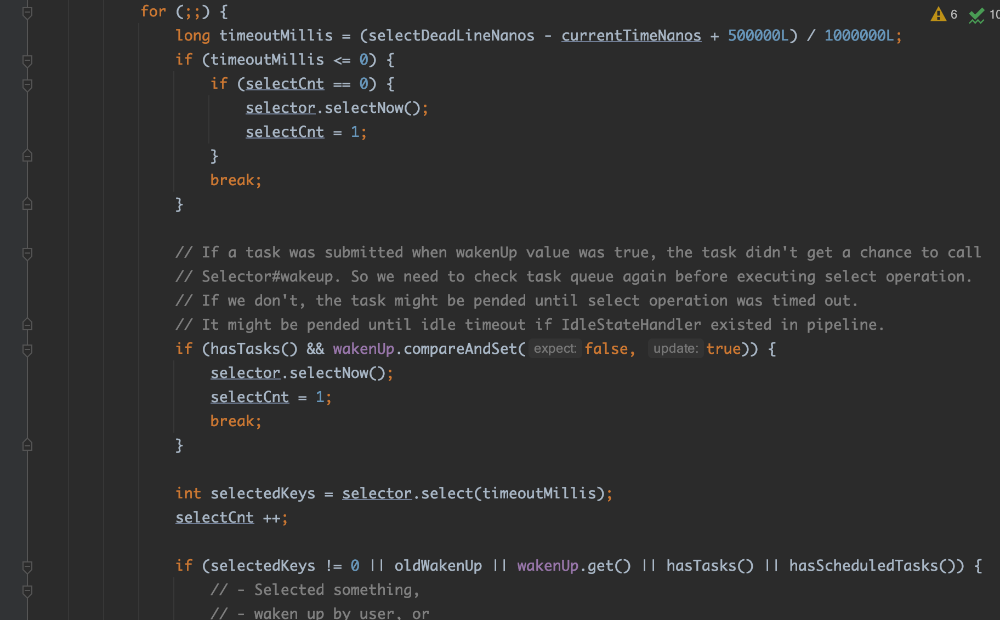   
基本逻辑就是一个死循环进行select，当select出key或被wakenup或有任务要处理时就break，其中要注意这个地方
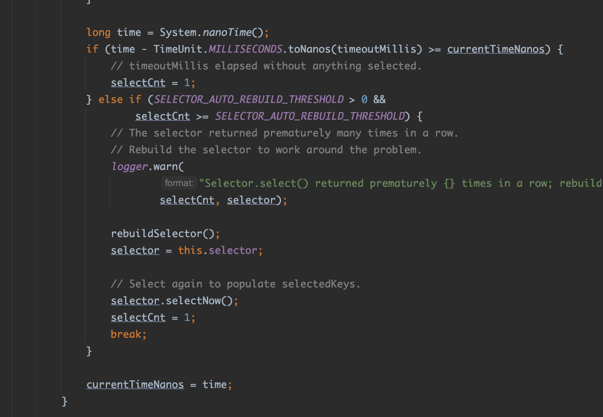
这个地方就是解决空轮询bug的问题，如果select阻塞时间小于传入的timeoutMillis，又没有select出key，就有可能出现空轮询bug了，当超过一个值（默认512）时就触发这个rebuildSelector逻辑。
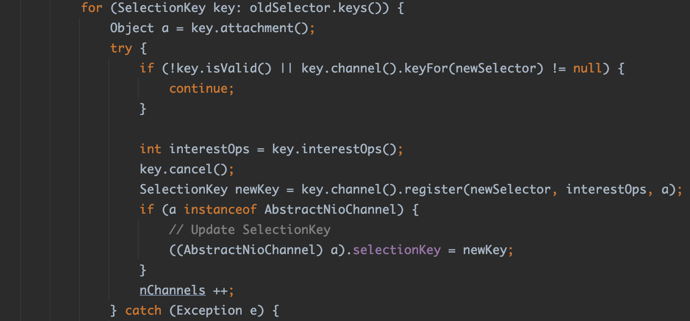
rebuildSelector就是把注册在原来selector上的key取消，再重新注册到新的selector上
2. 处理select keys
继续跟，进入processSelectedKeysOptimized方法的processSelectedKey函数调用，进入processSelectedKey方法
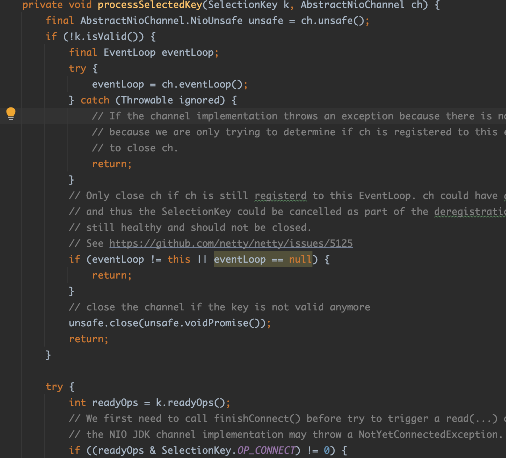
在这里就是处理各种事件，比如读，写，accecpt等
3. 运行all task
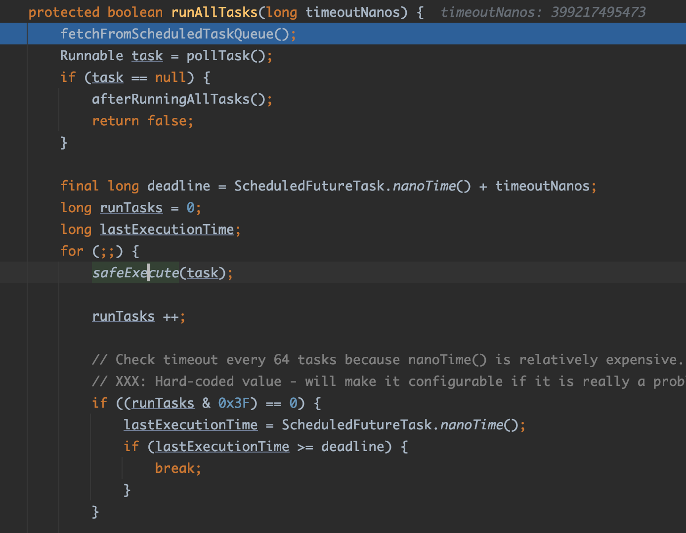
这里做了这几个事情
   1. 从定时任务队列拉取到期的任务放入task队列里
   2. 从taskQueue拉取任务
   3. 进行执行      
