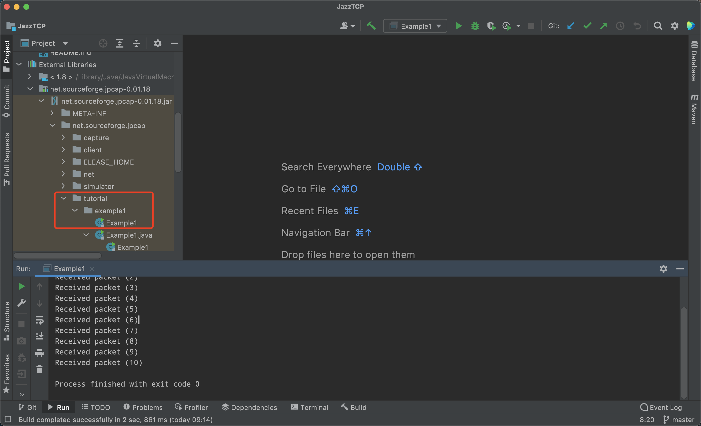

## 前言
最近在做一个用java实现的TCP/IP协议栈，以此来加深对TCP/IP协议的理解。因为需要直接操作网卡，需要使用jpcap这个库，本文记录一下jpcap在MacOS上的编译安装过程。
## 编译安装过程
1. 安装libpcap库，先去http://www.tcpdump.org/#old-releases下载源码进行编译安装，解压，configure，make，make install，完成了。
2. git clone git@github.com:jpcap/jpcap.git & cd jpcap
3. 修改文件
make/releases.makefile
++++ RELEASE_HOME=/Users/$USERNAME/dev/releases
++++ export RELEASE_HOME=/Users/$USERNAME/dev/releases
---- cp $(PROJECT_HOME)/$(LIB_PATH)/libjpcap.so $(SYS_DEST)/lib
++++ cp $(PROJECT_HOME)/$(LIB_PATH)/libjpcap.jnilib $(SYS_DEST)/lib

make/rules.makefile
---- $(JAVAC) $(JFLAGS) $*.java
++++ $(JAVAC) $(JFLAGS) -classpath .:/Users/wangjingguo/workspace/jpcap/src/java:/Users/wangjingguo/workspace/jpcap/thirdParty/jars/fooware_CommandLine-1.0.jar:/Users/wangjingguo/workspace/jpcap/thirdParty/jars/dev-classes_net.ultrametrics-0.03.jar:/Users/wangjingguo/workspace/jpcap/thirdParty/jars/junit.jar  $*.java

makefile
++++ PROJECT_HOME=/Users/wangjingguo/workspace/jpcap

scripts/env_jpcap
---- export PROJECT_HOME=~/dev/github/jpcap
++++ export PROJECT_HOME=/Users/wangjingguo/workspace/jpcap
---- export RELEASE_HOME=~/dev/releases
++++ export RELEASE_HOME=/Users/wangjingguo/dev/releases

src/c/makefile
---- LIBS = -lnsl /usr/lib/libpcap.a
++++ LIBS = -lnsl /usr/local/lib/libpcap.a
---- LIBS = /usr/lib/libpcap.A.dylib
++++ LIBS = /usr/local/lib/libpcap.A.dylib

src/java/net/sourceforge/jpcap/capture/jpcap.c
---- #include <JavaVM/jni.h>
++++ #include <jni.h>
---- for(;ifr < last; (char*)ifr += ifrSize, ifr=(struct ifreq *)s) {
++++ for(;ifr < last; ifr = (ifreq*)((char*)ifr + ifrSize), ifr=(struct ifreq *)s) {

src/java/net/sourceforge/jpcap/capture/makefile
----                   -I$(SDKROOT)/System/Library/Frameworks/JavaVM.framework/Headers
----       LIBS = /usr/lib/libpcap.A.dylib
++++                   -I$(SDKROOT)/System/Library/Frameworks/JavaVM.framework/Headers\
++++                   -I/Library/Java/JavaVirtualMachines/jdk1.8.0_271.jdk/Contents/Home/include/darwin\
++++                   -I/Library/Java/JavaVirtualMachines/jdk1.8.0_271.jdk/Contents/Home/include
++++        LIBS = /usr/local/lib/libpcap.A.dylib
----       javah -jni $(PKG).$(WRAPPER)
++++       javah -jni -classpath .:/Users/wangjingguo/workspace/jpcap/src/java:/Users/wangjingguo/workspace/jpcap/thirdParty/jars/fooware_CommandLine-1.0.jar:/U
sers/wangjingguo/workspace/jpcap/thirdParty/jars/dev-classes_net.ultrametrics-0.03.jar:/Users/wangjingguo/workspace/jpcap/thirdParty/jars/junit.jar  $(PKG).$
(WRAPPER)
 else
----       javah -jni $(PKG).$(WRAPPER)
++++       javah -jni -classpath .:/Users/wangjingguo/workspace/jpcap/src/java:/Users/wangjingguo/workspace/jpcap/thirdParty/jars/fooware_CommandLine-1.0.jar:/U
sers/wangjingguo/workspace/jpcap/thirdParty/jars/dev-classes_net.ultrametrics-0.03.jar:/Users/wangjingguo/workspace/jpcap/thirdParty/jars/junit.jar  $(PKG).$
(WRAPPER)

src/java/net/sourceforge/jpcap/capture/process.hpp
---- #include <JavaVM/jni.h>
++++ #include <jni.h>

src/java/net/sourceforge/jpcap/makefile
----       mkdir -p $(RH)/jdoc
----       mkdir -p $(RH)/jdoc/jpcap
----       javadoc -windowtitle $(JAVADOC_TITLE) \
----       -d $(RH)/jdoc/jpcap $(PKG_NAMES)
----       jar cvf $(JDOCJAR_NAME) -C $(RH)/jdoc/jpcap .
++++#      mkdir -p $(RH)/jdoc
++++#      mkdir -p $(RH)/jdoc/jpcap
++++#      javadoc -windowtitle $(JAVADOC_TITLE) \
++++#      -d $(RH)/jdoc/jpcap $(PKG_NAMES)
++++#      jar cvf $(JDOCJAR_NAME) -C $(RH)/jdoc/jpcap .
4. 让配置生效 ./scripts/env_jpcap  
5. make clean && make  
6. make release 
7. RELEASE_HOME里就已经生成了net.sourceforge.jpcap-0.01.16.jar，把它导入idea项目的module依赖就行了
## 运行

红圈里就是官方提供的实例